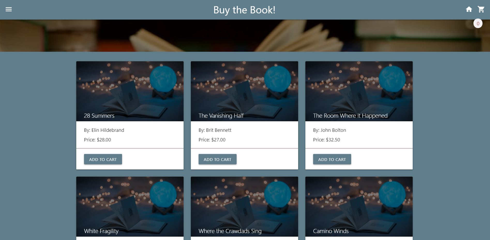
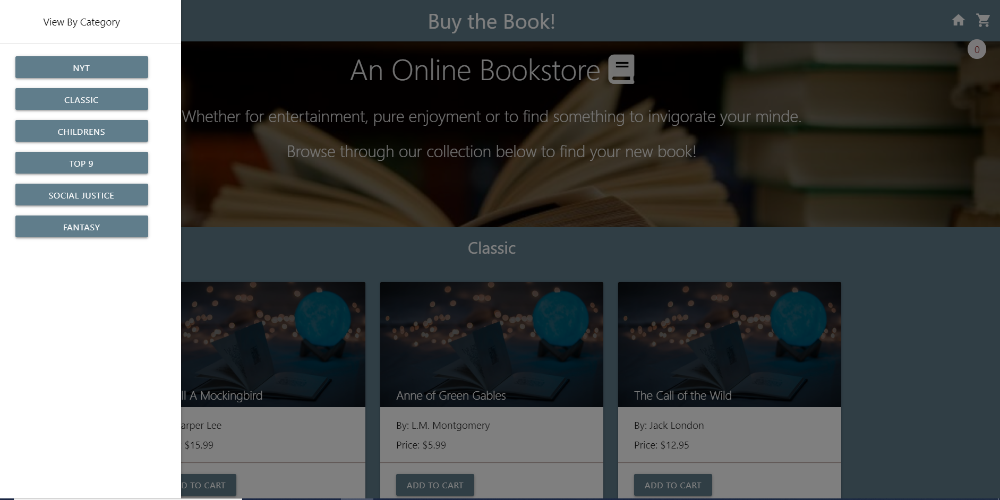

# Buy the Book_Project2

### Project 2 || Team Weezer (#2)

## Project Description
Buy the book! is an easy application for any book reader to select a book(s) from the selected categories and add to cart, if desired.

* [Link: Buy the Book!](https://buy-the-book.herokuapp.com/)

## How to navigate Buy the Book
* Browse random selection or select "hamburger" for genre categories
* Select a book
* Add to cart

## Sources
* Materialize CSS Framework (https://materializecss.com/)
* Lodash JS Library (https://lodash.com/)
* Accounting JS Library (http://openexchangerates.github.io/accounting.js/)

## Team Weezer Members
* Anitha Venkatesan
* Tom Johnson
* Sathya Guru
* Jacob Thompson
* Pangsua Vang
